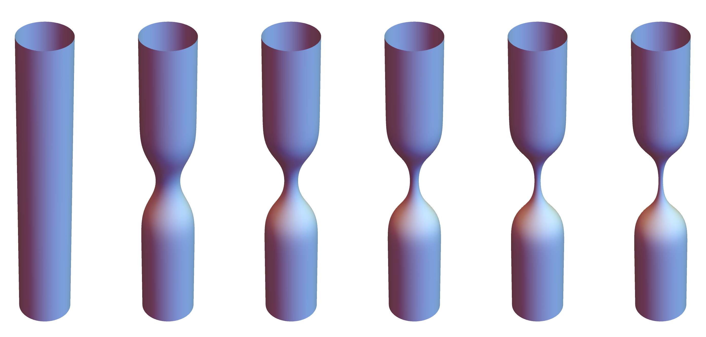

# Geometry dependence of quantum Hall states on surfaces

 &nbsp;

[](https://github.com/gamatos/msc_thesis/releases/download/v1.0.1/thesis.pdf) &nbsp; [](https://github.com/gamatos/msc_thesis/releases/download/v1.0.1/extended_abstract.pdf)

## Description

This repository hosts the thesis I submitted and successfully defended for the degree of [Master in Mathematics and Applications](https://fenix.tecnico.ulisboa.pt/cursos/mma). Also included is an extended abstract, a 10 page summary of the thesis. My advisor was [Prof. José Mourão](https://math.tecnico.ulisboa.pt/professor?who=jmourao). 

It led to the following publication, which resulted from further work with [Paulo Mourão](https://www.nccr-swissmap.ch/members/profile/view/310), [Bruno Mera](https://sites.google.com/view/bmera/home?pli=1) and [João Pimentel Nunes](https://www.math.tecnico.ulisboa.pt/~jpnunes/):

[`
Laughlin States Change Under Large Geometry Deformations and Imaginary Time Hamiltonian Dynamics.
Matos, G., Mera, B., Mourão, J.M., Mourão, P.D., Nunes, J.P.
Commun. Math. Phys. (2022)
`](https://doi.org/10.1007/s00220-022-04590-9)

## Abstract

We use geometric quantization and generalized coherent state transforms to determine how the ground state quantum Hall wave functions defined on a surface change as it undergoes an $S^1$-invariant deformation. This deformation is induced by the complexified flow of an $S^1$-invariant Hamiltonian vector field. We examine both the case of an infinite plane and of an infinite cylinder seen as toric Kähler manifolds. We find that the evolution does not significantly alter the structure of the single particle states and integer quantum Hall states. For fractional quantum Hall states, however, the polynomial structure is fundamentally changed, possibly reflecting the way that the Coulomb interaction between particles is affected by the change in the background geometry. In the case of the cylinder, in the limit of infinite imaginary time, the wave functions approximate distributional states concentrated on Bohr-Sommerfeld leaves. We compare some of these results with the existing literature.

## Compilation

There are two main documents, in LaTeX format: 

* The extended abstract, a 10 page summary of the thesis, contained in the [extended_abstract](extended_abstract) directory.
* The thesis itself, contained in the [thesis](thesis) directory.

Both documents make use of the `subfiles` LaTeX package. The files that must be built are the `.tex` document in the respective folder ([extended_abstract.tex](extended_abstract/extended_abstract.tex) for the extended abstract and [thesis.tex](thesis/thesis.tex) for the thesis); this will automatically include the files in corresponding `files` subfolder, which represent individual chapters/sections of each document.

The directory structure is as follows:

```
.
├── bib                # Bibliography files
├── extended_abstract  # Extended abstract LaTeX files
│   ├── files              # LaTeX subfiles for individual chapters/sections
│   └── packages           # LaTeX style files
├── img                # Image fles (plots, logos, ...)
├── latex_commands     # LaTeX commands/macro definitions
└── thesis             # Thesis LaTeX files
    ├── files              # LaTeX subfiles for individual chapters/sections
    └── packages           # LaTeX style files
```


